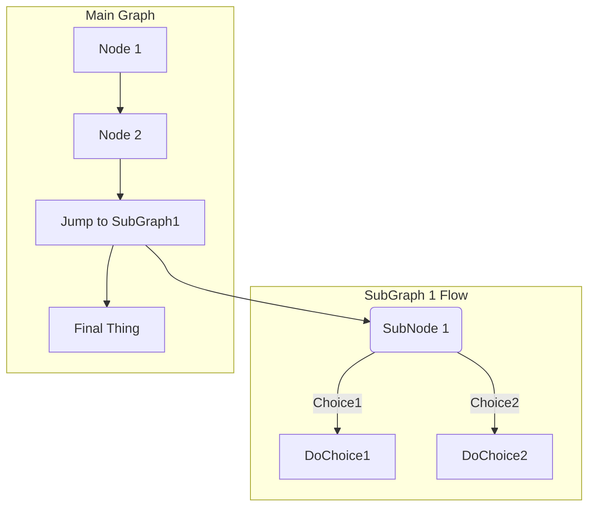
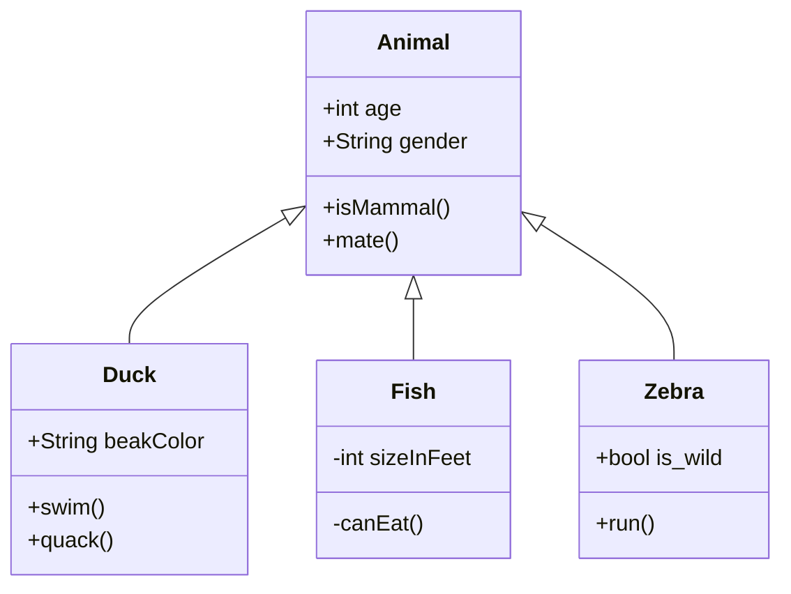
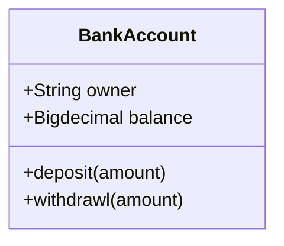

# docs_mermaid

```mermaid
graph TB

  SubGraph1 --> SubGraph1Flow
  subgraph "SubGraph 1 Flow"
  SubGraph1Flow(SubNode 1)
  SubGraph1Flow -- Choice1 --> DoChoice1
  SubGraph1Flow -- Choice2 --> DoChoice2
  end

  subgraph "Main Graph"
  Node1[Node 1] --> Node2[Node 2]
  Node2 --> SubGraph1[Jump to SubGraph1]
  SubGraph1 --> FinalThing[Final Thing]
end
```

```mermaid
graph TD
    A-->B
    A-->C
    B-->D
    C-->D
```

```mermaid
classDiagram
  Animal <|-- Duck
  Animal <|-- Fish
  Animal <|-- Zebra
  Animal : +int age
  Animal : +String gender
  Animal: +isMammal()
  Animal: +mate()
  class Duck{
      +String beakColor
      +swim()
      +quack()
  }
  class Fish{
      -int sizeInFeet
      -canEat()
  }
  class Zebra{
      +bool is_wild
      +run()
  }
```

```mermaid
classDiagram
  class BankAccount
  BankAccount : +String owner
  BankAccount : +Bigdecimal balance
  BankAccount : +deposit(amount)
  BankAccount : +withdrawl(amount)
```